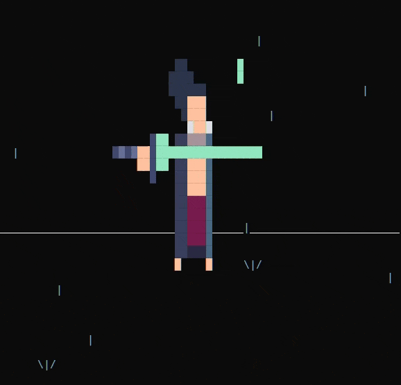
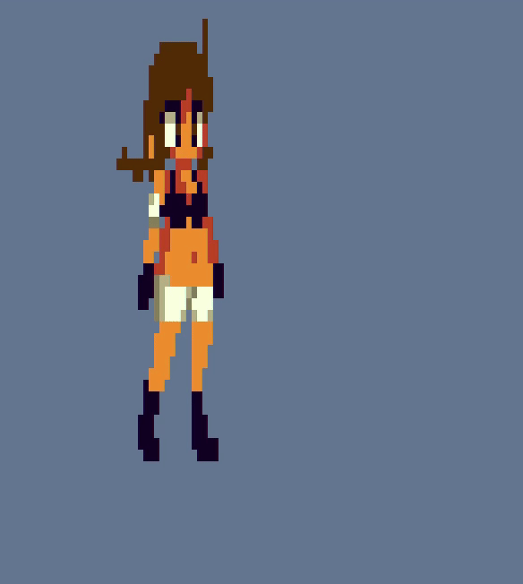
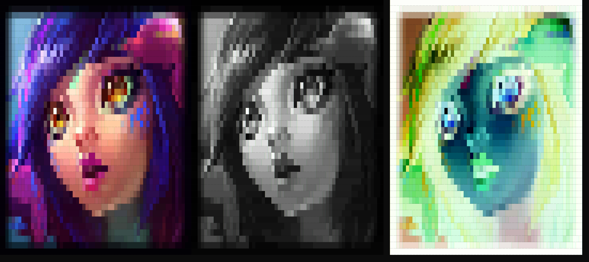

<h1 align="center">tsprite</h1>

<p align="center">Convert Sprites to Windows escape sequences, optimized for Conhost games</p>

## Features

* Outputs transparent, cursor dependent sprites
* Ample customization such as filters, character distribution, character sets (supporting unicode)
* Various optimizations / parameters for Conhost usage
* Two ways to use
    * C99 single header library for use in programs
    * CMD Tool for use in scripts or the prompt

## Usage
This tool is **NOT** created for displaying detailed terminal art. There are many awesome tools out there that do that. Rather, this is aimed at converting small to medium sized sprites into sequences optimized for use in Conhost games, specifically Batch Script games. Printing to console repeatedly is a bottleneck in Batch Script, especially those relying on high performance such as simulations, which is exacerbated by slow VT100 sequence processing in Conhost. Therefore, this tool outputs sprites in the shortest possible sequences, with a variety of options to adjust the output.

**Important** : this is Windows 10+ only, for use in Conhost or Windows Terminal. List of supported image types at the top of [here](https://github.com/nothings/stb/blob/master/stb_image.h).

## Examples

### Animated Sprite + Overlay Animation



### Multiple Animated Sprites + Movement



### Static Sprite + Various Filters



## How to Use Library

1. Download dependencies [```stb_image.h```](https://github.com/nothings/stb/blob/master/stb_image.h) and [```stb_image_resize2.h```](https://github.com/nothings/stb/blob/master/stb_image_resize2.h). Include in the same directory as ```lib_tsprite.h```.

2. Include ```lib_tsprite.h``` in your project. Like other single header libraries, define ```TSPRITE_IMPLEMENTATION``` before you include this file in **one** C file to create the implementation.

3. See ```samurai``` in examples

## How to Use CMD Tool

1. Download above dependencies, ```lib_tsprite.h```, and [```argparse```](https://github.com/cofyc/argparse). Include necessary files in same directory as ```tsprite.c```.
2. Compile ```tsprite.c``` and link together with ```args.c```. You can either use Cmake, but it is also simple via the commandline. For example, with MSVC, it can be as simple as

```
cl tsprite.c args.c
```

3. See ```google``` in examples

## Optimizations
* Reuse previous colour sequences if within threshold
* Aggressive transparency sequences removal, including trailing transparency
* Squash empty lines / transparent areas into single sequence
* Convert Truecolour sequences to colour index sequences if within threshold
* Two different sequence output modes suited for different use cases
* Two different display modes suited for different use cases
* Argument in cursor position sequences omitted if 1


## Tool Docs
The tool is a lighter version of ```lib_tsprite```. For list of options and descriptions, run

```
tsprite --help
```

The options and defaults are directly correlated from the library, so see below table if you need more detailed descriptions. For non-mandatory arguments, the default values for their field are also from the below table. The output is displayed from ```stdout```. This means you can use redirect / pipe it to whatever file / console / command you need.

## Library Docs

### Function

```C
enum tpaint_error tpaint_get_sequence(char const* file, struct tsprite_param* param)
```

```file``` is the image you want to use. ```param``` is the list of options, or ```NULL``` if you want all defaults.

### Parameters

You **do not** have to include all the parameters. In C99, you can specify individual members; the unspecified ones will be the **default** values. For example:

```C
struct tsprite_param param = {
    .scale_x = 17,
    .scale_y = 24
};
```

| Parameters  | Description | Type | Default |
| ------------- | ------------- | ------------- | ------------- | 
| ```adj_x``` | Width of output sprite | ```int``` | ```Entire Width``` |
| ```adj_y``` | Height of output sprite | ```int``` | ```Entire Height``` |
| ```area``` | Area of image to convert in the form ```&(struct tsprite_rect) { x, y, w, h }``` | Read desc | Entire image |
| ```filter``` | Filters image. Function pointer that filters image. Predefined are ```filter_greyscale```, ```filter_invert```, ```filter_sepia```, ```filter_none```. Custom filter requires a function of type ```void (*filter)(struct tsprite_col*)```, where the first param is the current colour | Read desc | ```filter_none()``` |
| ```str_len``` | Length of character set | ```int``` | ```1``` |
| ```str_set``` | Character set; set of characters to make up image | ```char const**``` | ```{ " " }``` |
| ```str_func``` | Function that determines where to put characters. Can be ```char_bright``` (brighter colours will get higher set characters), ```char_rand``` (random), and ```char_first``` (first character of set), or you can pass in your own function in the form ```char const* (*str_func)(struct tsprite_col, int, char const**)```, where the first param is the current colour, and the next are ```str_len``` and ```str_set``` | Read desc | ```char_first()``` |
| ```use_cursor_seq``` | If set to true, uses cursor movement sequences which is generally smaller for sprites with lots of transparency. If false, uses save cursor position sequences, which is smaller for sprites with little transparency, but will overwrite the save cursor if said sequences are being used | ```bool``` | false |
| ```disp``` | Type of colouring to use. One of ```TSPRITE_DISP_BKG``` (colour background) or ```TSPRITE_DISP_CHAR``` (colour characters) | Read desc | ```TSPRITE_DISP_BKG``` |
| ```col_threshold``` | If the distance between colours is <= this value, the colours are equal. Uses the formula [here](https://www.compuphase.com/cmetric.htm). Range is 0 to 765 | ```float``` | 0 |
| ```equiv_threshold``` | Only used if ```equiv_type``` set to ```TSPRITE_EQUIV_THRESHOLD```. If the distance between a current colour and a preset (colour index) colour is <= this value, the colours are equal. Uses the formula [here](https://www.compuphase.com/cmetric.htm). Range is 0 to 765 | ```float``` | 0 |
| ```equiv_type``` | Determines mode of replacing Truecolour sequences with colour index sequences. Please note that these preset colours can be set via GUI, registry, escape sequences, ect, so ```tsprite``` assumes the default preset colours. Can be     ```TSPRITE_EQUIV_NONE``` (never replace), ```TSPRITE_EQUIV_ALL``` (always replace), ```TSPRITE_EQUIV_THRESHOLD``` (replace based on ```equiv_type```) | Read desc | ```TSPRITE_EQUIV_NONE``` |
| ```ret_str``` | If not ```NULL```, puts the dynamically allocated sequence string to the pointer | ```char const**``` | ```NULL``` |
| ```ret_file``` | If not ```NULL```, writes sequence to the file | ```char const*``` | ```NULL``` |
| ```append_file``` | Append to file if true | ```bool``` | ```false```|

## Error Handling

```tsprite_get_sequence()``` will return one of these errors.

| Error | Meaning |
| ------------- | ------------- |
| ```TSPRITE_ERROR_NONE``` | No errors, all good! |
| ```TSPRITE_ERROR_IMAGE``` | Image failed to load |
| ```TSPRITE_ERROR_RESIZE``` | Image could not be resized |
| ```TSPRITE_ERROR_MEMORY``` | Cannot allocate memory for sequence |
| ```TSPRITE_ERROR_COORD``` | ```area``` was not in bounds |
| ```TSPRITE_ERROR_FILE``` | File to write cannot be opened |


