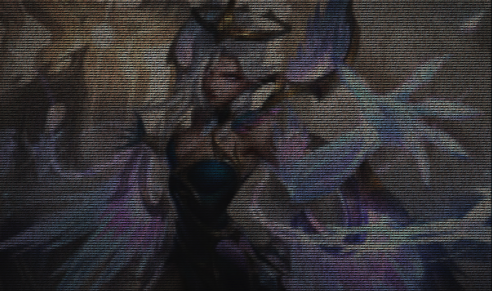

<h1 align="center">tsprite</h1>

<p align="center">A single header library to convert images to Windows escape sequence sprites</p>

## Features

* Simple to use : only one function!
* Supports transparency (shows characters underneath in console)
* Can be placed anywhere from cursor position
* Optional background colour
* Optional colour blending
* Custom character sets (with unicode)
* Custom filters, area, character distribution, colouring
* Sprites optimized for space

## Usage
This library is intended for sprite based graphics in console based games / visualizations. For example, creating console sprites in Batch file games (see examples). The various options allow you to create sprites that support layering and take up as little characters as possible. Furthermore, it is Windows 10+ only, using sequences from Microsoft's VT100 sequence emulation.

## How to Include

1. Download ```stb_image.h``` [here](https://github.com/nothings/stb/blob/master/stb_image.h), include in the same directory as ```tsprite.h```.

2. Include ```tsprite.h``` in your project. Important : this is Windows 10+ only. List of supported image types at the top of [here](https://github.com/nothings/stb/blob/master/stb_image.h). This library uses "Truecolor" escape sequences, which only works if your console supports it.

## Examples

### Transparent Sprite + Overlay Animation


### Large-Scale Sprite + Alternate Character Set



### Single Sprite + Various Filters


## Documentation

### Function

```C
enum tpaint_error tpaint_get_sequence(char const* file, struct tsprite_param* param)
```

```file``` is the image you want to use. ```param``` is the list of options, or ```NULL``` if you want all defaults.

### Parameters

You **do not** have to include all the parameters. In C99, you can specify individual members; the unspecified ones will be the **default** values. For example:

```C
struct tsprite_param param = {
    .scale_x = 17,
    .scale_y = 24
};
```

| Parameters  | Description | Type | Default |
| ------------- | ------------- | ------------- | ------------- | 
| ```scale_x``` | X scale of image. Higher is smaller | ```int``` | ```1``` |
| ```scale_y``` | Y scale of image. Higher is smaller | ```int``` | ```1``` |
| ```area``` | Area of image to convert in the form ```&(struct tsprite_rect) { x, y, w, h }``` | Read desc | Entire image |
| ```range``` | Number of characters to blend | ```int``` | ```0``` |
| ```blend``` | Blend surrounding colours (take average rgb values) according to range. One of ```TSPRITE_BLEND_NONE```, ```TSPRITE_BLEND_X``` (samples from x direction), ```TSPRITE_BLEND_Y``` (samples from y), ```TSPRITE_BLEND_XY``` (samples from x and y)| Read desc | ```TSPRITE_BLEND_NONE``` |
| ```filter``` | Filters image. Function pointer that filters image. Predefined are ```filter_greyscale```, ```filter_invert```, ```filter_sepia```, ```filter_none```. Custom filter requires a function of type ```void (*filter)(struct tsprite_col*)```, where the first param is the current colour | Read desc | ```filter_none()``` |
| ```str_len``` | Length of character set | ```int``` | ```1``` |
| ```str_set``` | Character set; set of characters to make up image | ```char const**``` | ```{ " " }``` |
| ```str_func``` | Function that determines where to put characters. Can be ```char_bright``` (brighter colours will get higher set characters), ```char_rand``` (random), and ```char_first``` (first character of set), or you can pass in your own function in the form ```char const* (*str_func)(struct tsprite_col, int, char const**)```, where the first param is the current colour, and the next are ```str_len``` and ```str_set``` | Read desc | ```char_first()``` |
| ```alpha_rep``` | Colour to replace transparency in the form ```&(struct tsprite_col) { r, g, b, a }``` | Read desc | Transparent |
| ```use_cursor_seq``` | If set to true, uses cursor movement sequences ([D and [B) (in general, more characters). If false, uses save cursor position sequences ([s and [u), which interfere if you are using save cursor sequences for other purposes | ```bool``` | false |
| ```disp``` | Type of colouring to use. One of ```TSPRITE_DISP_BKG``` (colour background) or ```TSPRITE_DISP_CHAR``` (colour characters) | Read desc | ```TSPRITE_DISP_BKG``` |
| ```col_threshold``` | The threshold to determine if a colour is the same. For example, with 10, it won't create a new colour sequence if all of the current colour values are within 10 of the previous | ```int``` | 0 |
| ```ret_str``` | If not ```NULL```, puts the dynamically allocated sequence string to the pointer | ```char const**``` | ```NULL``` |
| ```ret_file``` | If not ```NULL```, writes sequence to the file | ```char const*``` | ```NULL``` |
| ```append_file``` | Append to file if true | ```bool``` | ```false```|

## Error Handling

```tsprite_get_sequence()``` will return one of these errors.

| Error | Meaning |
| ------------- | ------------- |
| ```TSPRITE_ERROR_NONE``` | No errors, all good! |
| ```TSPRITE_ERROR_IMAGE``` | Image failed to load |
| ```TSPRITE_ERROR_MEMORY``` | Cannot allocate memory for sequence |
| ```TSPRITE_ERROR_COORD``` | ```area``` was not in bound |
| ```TSPRITE_ERROR_FILE``` | File to write cannot be opened |
